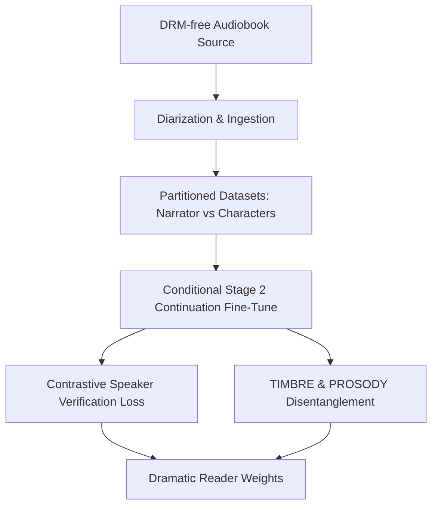

# High-Ambition 2 — 🚀 "Dramatic Reader" & Full-Cast Audiobooks

> **Sequence:** 2 of 5. Builds directly on the [1 — Matcha-TTS actor](high-ambition-1-matcha-actor.md)
> (needs a trained, directable, castable actor first). Then:
> [3 — Child Voices](../Prosodia/high-ambition-3-child-voices.md) ·
> [4 — Multilingual G2P](../Prosodia/high-ambition-4-multilingual-g2p.md) ·
> [5 — StyleTTS2-Lite](high-ambition-5-styletts2-lite.md).

> [!NOTE]
> **Base-model framing:** this note was written against **StyleTTS2's disentangled style-vector
> space** (speaker LUT into style space, ECAPA verification loss on the style encoder, etc.). With
> **Matcha** as the now-first base, the *challenges* (timbre↔prosody disentanglement, diarization,
> boundary smoothing) are unchanged, but the *mechanism* maps to **per-character speaker embeddings +
> the VAT/FiLM conditioning** from [high-ambition-1](high-ambition-1-matcha-actor.md). The
> StyleTTS2-specific design below applies as-written if/when we graduate to
> [5 — StyleTTS2-Lite](high-ambition-5-styletts2-lite.md).

This engineering note outlines the design challenges, architecture adjustments, and training plan modifications required to evolve the StyleTTS2-Lite model from a single-narrator text-to-speech model into a **"dramatic reader" variant** capable of rendering **full-cast audiobooks** (multi-voice, multi-character performances with consistent identities).

---

## 🎯 Objective
Construct a specialized post-training variant of StyleTTS2-Lite that can dynamically shift its vocal timbre, accent, pitch register, and emotional expression to represent multiple distinct characters and a narrator within the same book, all while maintaining perfect speaker identity consistency across chapters.

---

## 🧠 Core Challenges in Full-Cast Audiobook Synthesis

Full-cast audiobook generation presents several unique deep learning and engineering bottlenecks, especially when constrained to a lightweight model size like **StyleTTS2-Lite** (80-100M parameter architecture).

### 1. Timbre Identity Consistency vs. Emotional Expression
In StyleTTS2, the latent style space conflates speaker identity (vocal timbre) and prosody (speed, pitch contour, emotional delivery). 
*   **The Dilemma**: If a character gets angry, the style vector shifts. In a naive model, this shift often alters the *speaker's identity* (e.g., a male voice sounding female, or a young character sounding old).
*   **The 50% Dominance Threshold**: Auditory testing shows that when a dynamic style blend consists of **50% or more** of any single anchor voice, it sounds like an entirely different person compared to a blend dominated (50%+) by a different anchor.
    *   *Single-Narrator Constraint*: To prevent a single narrator or character's voice from drifting into alternating vocal identities across sentences, the voice blending engine must enforce a maximum threshold (e.g., restricting coordinate amplification or capping individual contributor weights).
    *   *Full-Cast Leverage*: In full-cast audiobook settings, this boundary can be deliberately crossed: by pushing VAD coordinates past the 50% dominance mark, the system can morph the base voice into distinct character identities on-the-fly, functioning as different cast members.
*   **Goal**: Disentangle **Timbre** (who is speaking) from **Prosody** (how they are speaking) or utilize controlled blending thresholds to manage voice identity shifts.

### 2. Parameter Capacity Constraints
StyleTTS2-Lite is exceptionally compact. Forcing a single lightweight model to master multiple high-fidelity voices (varying by gender, age, and accent) without mutual degradation (mode collapse or catastrophic forgetting of pronunciation rules) pushes the limits of model capacity.

### 3. Upstream Character Attribution & Diarization
The text ingestion pipeline must identify who is speaking. The upstream Director LLM (Gemma) must perform character diarization/attribution on the fly, outputting structural annotations mapping text spans to specific character profiles:
```json
[
  { "speaker": "narrator", "text": "He paused at the door, then turned and whispered," },
  { "speaker": "john_hushed", "text": "\"Don't look back.\"" }
]
```

### 4. Acoustic Boundary Transitions
Switching between the narrator's voice and a character's voice at word boundaries can introduce:
*   Phase discontinuities and audio pops.
*   Sudden, unnatural shifts in volume (gain) and baseline pitch (F0).
*   Timing issues, such as a character speaking too quickly or immediately after the narrator without a breathing pause.

---

## 🔄 Alterations to the Training Plan

Transitioning from the **Single-Narrator ("Prosodia-Narrator")** recipe to a **Dramatic Multi-Voice Variant** requires fundamental changes to data preparation, network architecture, and training loss constraints.



### 1. Preprocessing & Ingestion Pipeline Modifications
*   **Automated Diarization**: The ingestion pipeline (utilizing WhisperX for forced alignment) must integrate a speaker diarization model (e.g., `pyannote/speaker-diarization`).
*   **Timbre Clustering**: The pipeline must cluster audio slices by speaker, verifying that the narrator's voice and character voices are partitioned into distinct subsets.
*   **Metadata Labeling**: The generated training manifest (`train_list.txt`) must include a speaker identity tag:
    `dataset/wavs/chunk_001.wav|john_voice|he was trying to escape`

### 2. Architecture Adjustments during Fine-Tuning
*   **Conditional Prosody Predictor**: In standard StyleTTS2, the Prosody Predictor predicts F0, energy, and duration from phonemes and a generic style vector. To support full-cast, we must feed a conditional **Speaker ID embedding** to the Prosody Predictor and the Decoder.
*   **Speaker Look-Up Table (LUT)**: We will train a small, dedicated lookup table of speaker embeddings (1x512 per character) that project into the style space, acting as anchors.

### 3. Training Loss & Discriminator Overhaul
To enforce timbre consistency while allowing emotional range, the training loop must include:
*   **Speaker Classifier Loss**: An auxiliary classifier trained on top of the Style Encoder to ensure that style vectors generated for character $X$ are always classified as character $X$, regardless of emotion.
*   **Pre-trained Speaker Verification Loss**: Integrate a frozen, pre-trained speaker verification network (e.g., `ECAPA-TDNN`) as an acoustic discriminator. It computes the cosine similarity between generated audio and reference character audio, penalizing timbre drift.
*   **Style Reconstruction Loss**: Regularize the style encoder to map variations in pitch and energy separately from baseline vocal tract characteristics.

### 4. Training Scaffold Modification
*   Instead of freezing early phoneme mapping blocks and training only the Style Encoder, we must train the **Decoder's synthesis layers** to adapt to the wide pitch and formant variations of different genders and ages.
*   **Stage 2 Multi-Speaker Tuning**: Initialize training from the StyleTTS2-Lite base model checkpoint, but fine-tune both the Decoder and Style Predictor using a low learning rate ($1 \times 10^{-5}$) on the multi-character dataset to avoid overriding phoneme pronunciation.

---

## 🛠️ Proposed Runtime Integration & Inference

### Dynamic Style Vector Blending
At runtime, the actor pipeline will generate the final style vector by combining the **Character Identity Embedding** and the **Emotional Modifier Vector**:

```python
import torch

def generate_full_cast_style(char_embedding_path, emotion_vector_path, emotional_intensity=0.40):
    """
    Blends a character's base vocal identity with an emotional style vector.
    """
    v_char = torch.load(char_embedding_path, map_location='cpu') # Fixed identity (timbre)
    v_emotion = torch.load(emotion_vector_path, map_location='cpu') # Dynamic emotion (prosody)
    
    # Interpolate to preserve identity while injecting prosody shifts
    blended_style = v_char + (v_emotion * emotional_intensity)
    return blended_style
```

### Boundary Smoothing
*   **Cross-Fade Synthesis**: When transition boundaries between speaker profiles are detected, the Actor engine will apply a short (e.g., 5-10ms) linear amplitude cross-fade on the output PCM buffers to prevent phase-mismatch clicks.
*   **Silence Padding**: Programmatically inject breathing silence (150-300ms) between narrator-character transitions based on punctuation tags in the Director's payload.
