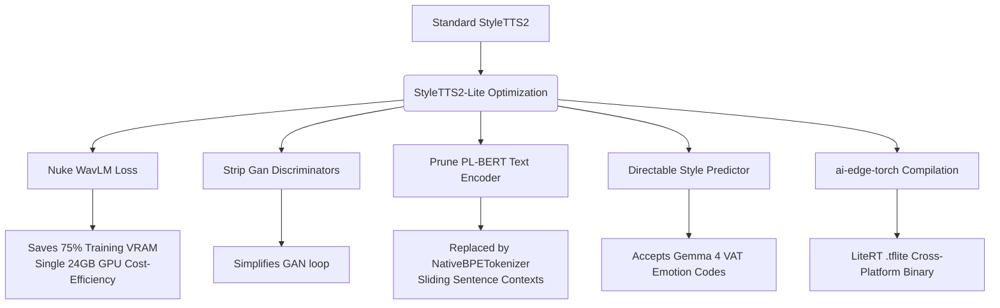

# High-Ambition 5 — 🏆 StyleTTS2-Lite Custom Model (higher-ceiling re-platform)

> **Sequence:** 5 of 5 — the **optional quality-ceiling upgrade**, attempted only *after* shipping
> the [1 — Matcha-TTS actor](high-ambition-1-matcha-actor.md) **if** its naturalness or
> expressiveness falls short (the [dramatic-reader](high-ambition-2-dramatic-reader.md) axis is where
> StyleTTS2's higher ceiling shows most). This was originally planned as the *first* model; the
> decision in [actor-model-and-training.md](actor-model-and-training.md) moved Matcha ahead of it
> because StyleTTS2's multi-stage adversarial training is a brutal first endeavor. **Most of the
> Matcha work transfers here** (VAT directability, casting machinery, data pipeline, export) — see
> the transfer table in [high-ambition-1-matcha-actor.md](high-ambition-1-matcha-actor.md).

This engineering note outlines the design, training strategy, and architecture of **StyleTTS2-Lite**, a custom text-to-speech (TTS) model designed specifically for Project Prosodia. 

> [!IMPORTANT]
> **Export-route correction (supersedes the body below):** the original plan promoted Google's
> `ai-edge-torch` as the "Gold Standard" compile path. A 2026-06-14 spike **overturned that** — the
> validated backbone is **`torch → ONNX`** (with ONNX→TFLite via `onnx2tf` still to be exercised).
> The `ai-edge-torch` references in §5 and the Implementation Plan below are kept for context but are
> **no longer the route**; see the [Export & Runtime Decision](#-export--runtime-decision-2026-06-14)
> at the end of this file and [actor-model-and-training.md](actor-model-and-training.md).
> *(Second correction, 2026-07-12: the priority reversed again once fixed-shape re-authoring made
> `litert-torch` viable — the **split-graph `litert-torch` export is now Plan A** and the
> ONNX→`onnx2tf` monolith the fallback; see the 📌 callout in
> [next-steps.md](../Prosodia/next-steps.md). Any StyleTTS2-Lite re-platform should target the
> split-graph pattern from the start.)*

> [!NOTE]
> **Framing correction (per the model decision — supersedes "will transition" below):** this is the
> *conditional Phase-2 re-platform*, **not** a committed next step. The first shipped actor is
> [Matcha-TTS](high-ambition-1-matcha-actor.md); Prosodia moves to a custom StyleTTS2-Lite **only if**
> Matcha's naturalness/expressiveness falls short (see the header and
> [architecture-north-star.md §5](../Prosodia/architecture-north-star.md)). "From scratch" here means the StyleTTS2
> **re-architecture** (replace LSTMs, strip WavLM/discriminators, swap the diffusion sampler) —
> warm-started from existing checkpoints where possible — which the North Star reserves for exactly
> this v2 slot. It does not contradict the "build ON Matcha first" default.

Should this re-platform be taken up, Prosodia trains its own custom variant of the StyleTTS2 framework rather than continuing to fine-tune or patch Kokoro-82m on remote GPU pods. This custom model is stripped of non-essential inference overhead, dramatically reducing training memory requirements and enabling resource-efficient runtime execution.

---

## 🎯 Objective
Construct a lightweight, highly responsive, and directable multi-voice text-to-speech model from scratch using the StyleTTS2 framework, optimized for consumer-grade training (e.g., a single 24GB VRAM GPU) and ultra-fast, on-device mobile synthesis compiled for the unified LiteRT runtime.

---

## 🏛️ End-to-End Pipeline Architecture

The Prosodia runtime integrates a modular pipeline spanning text ingestion, emotional annotation, and vocal synthesis, unified by Google's LiteRT runtime on-device:

```
┌─────────────────────────────────────────────────────────────────┐
│                    FOLIO PARSER (Rust Crate)                    │
│   Parses EPUB text structures & passes segments forward.       │
└────────────────┬────────────────────────────────┘
                                 │ Text segments
                                 ▼
┌─────────────────────────────────────────────────────────────────┐
│             PROSODIA DIRECTOR (LiteRT-LM Framework)             │
│   Model: Gemma 4 E2B-IT / E4B-IT (.litertlm flatbuffer)         │
│   Uses Thinking Mode & Multi-Token Prediction to ultra-fastly   │
│   generate character emotion markers & style metadata tokens.   │
└────────────────┬────────────────────────────────┘
                                 │ Text Tokens + Dynamic Style Multipliers
                                 ▼
┌─────────────────────────────────────────────────────────────────┐
│              PROSODIA ACTOR (Base LiteRT Runtime)               │
│   Model: Converted StyleTTS2-Lite Core (.tflite graph)          │
│   Uses the CompiledModel API to execute non-linear voice        │
│   inflections with direct NPU/GPU hardware acceleration.        │
└─────────────────────────────────────────────────────────────────┘
```

1. **Folio Parser (Rust Crate):** Parses EPUB structures, chapter segments, and paragraph layouts to yield raw text segments.
2. **Prosodia Director (LiteRT-LM Framework):** Evaluates character sentiment and dialogue using a `.litertlm` Gemma 4 E2B-IT or E4B-IT model, running in thinking mode with multi-token prediction to output token-level style/emotion multipliers.
3. **Prosodia Actor (Base LiteRT Runtime):** Synthesizes high-fidelity speech from raw phoneme streams and dynamic style inputs using a unified `.tflite` StyleTTS2-Lite model. On-device execution is accelerated via the LiteRT `CompiledModel` API targeting neural engines and GPUs.

---

## 🧠 StyleTTS2-Lite Architecture & Optimization

Standard StyleTTS2 is a highly natural model, but its training and runtime footprint can be optimized significantly for specialized platforms like Apple Silicon and mobile devices. StyleTTS2-Lite implements five major modifications:



### 1. Nuking WavLM (Training Optimization)
* **The Problem:** In standard StyleTTS2 training, **WavLM** is used as an auxiliary feature extractor to calculate a speech representation loss, ensuring the synthesized audio sounds natural. However, the WavLM block is massive, consumes up to 70–80% of the training VRAM, and is completely discarded once training is complete (it is unused during inference).
* **The Lite Solution:** Remove the WavLM loss constraint entirely from the training loop. We replace it with:
  * A multi-resolution Mel-spectrogram loss.
  * A self-supervised acoustic distance loss computed on the ISTFTNet spectrogram projections.
* **The Impact & RunPod Cost-Efficiency:** Reduces training memory footprint by ~75%. Instead of requiring multi-GPU enterprise clusters (costing ~$8/hr for an 8x A100 node), we can train the model with much larger batch sizes on a **single 24GB RTX 4090 or RTX 3090** instance (costing under **$0.50/hr** on RunPod).

### 2. Stripping Adversarial Discriminators (Generator Optimization)
* **The Problem:** GAN-based speech synthesis relies on multiple sub-discriminators (e.g., Multi-Period Discriminator, Multi-Scale Discriminator) to evaluate frequency, phase, and pitch errors.
* **The Lite Solution:** Strip down the adversarial discriminator layers to the absolute minimum necessary for clean waveform generation.
  * Delete phase-error discriminators, as the ISTFTNet decoder natively resolves phase alignment.
  * Rely on a simplified single-scale spectral discriminator and a pitch/energy checker.
* **The Impact:** Speeds up the adversarial training passes by ~40% and prevents training instability/divergence.

### 3. Pruning the BERT Layer & Multi-Scale Contextual Text Encoding (Inference & Footprint Optimization)
* **The Problem:** Kokoro and standard StyleTTS2 pass text through a heavy pre-trained **PL-BERT** (or ALBERT) language model to generate semantic context embeddings before phonemization. This PL-BERT model is a heavy dependency, adding startup latency and memory overhead on low-end devices. Additionally, BERT-based TTS tends to synthesize in isolated sentence blocks, yielding a choppy, disconnected flow over paragraph boundaries.
* **The Lite Solution:** Remove the PL-BERT model and introduce sliding-window sentence context:
  * Extract token-to-phoneme mapping logic directly using direct G2P dictionary lookups.
  * Replace the BERT semantic layers with our own zero-dependency, compiled lookup maps utilizing the core `NativeBPETokenizer` in [crates/core](../../Prosodia/crates/core).
  * Pass a sliding window of neighboring sentences (using explicit separators) into the **Text Encoder** rather than processing isolated sentences.
  * Train the Text Encoder layer directly on these contextual raw phoneme input sequences without PL-BERT context vectors.
* **The Impact:** Drastically reduces the package footprint (saves ~50MB of binary size) and reduces inference cold-start latency to near-zero. Furthermore, the model learns paragraph-level semantic and rhythmic flow, avoiding the "choppy" boundaries typical of sentence-by-sentence Kokoro synthesizers.

### 4. Directable Style Predictor (Emotional Conditioning)
* **The Problem:** In Kokoro and vanilla StyleTTS2, the style predictor determines voice styling implicitly from target reference audios or averaged static style matrices. This makes it impossible to programmatically modulate the voice for specific moods or dramatic inflections during dialogue.
* **The Lite Solution:** Modify the **Style Predictor** module to accept direct conditioning vectors representing emotional and vocal markers generated by our **Prosodia Director** (Gemma 4). During training, we pair the phonemes with Director-style control dimensions:
  * **Valence ($V$):** Tone positivity or negativity.
  * **Arousal ($A$):** Energy level (e.g., whisper vs. shout).
  * **Tempo ($T$):** Speaking rate.
* **The Impact:** Connects the Director's thinking-mode emotional markers directly to acoustic generation, allowing us to enforce consistent character voicing, emotional range, and pacing modulations dynamically.

### 5. Google LiteRT Export via ai-edge-torch (Inference Portability)
* **The Problem:** Deploying PyTorch-trained StyleTTS2 subgraphs to run optimally across distinct hardware target backends (such as Android NNAPI/TPU and iOS CoreML/Metal) usually requires maintaining multiple export scripts, platform-specific wrappers, and separate binaries.
* **The Lite Solution:** Trace and compile the PyTorch-based StyleTTS2-Lite generation sub-modules directly to a single unified LiteRT (`.tflite`) file using Google's **`ai-edge-torch`** compiler.
* **The Impact:** Provides cross-platform, hardware-accelerated synthesis via a single asset file. On-device execution runs natively inside the LiteRT library via the `CompiledModel` API.

---

## 🔄 The Dual-Stage Training Pipeline

We will train StyleTTS2-Lite in a clean, two-stage process:

```
[ Stage 1: Alignment Training ]
- Train Duration Predictor & Text Encoder
- Align phonemes with target Mel-spectrograms & sentence contexts
        |
        v
[ Stage 2: Waveform Synthesis GAN ]
- Train ISTFTNet Decoder & Style Predictor
- Optimize with simplified discriminators (No WavLM)
- Condition Style Predictor on Director VAT parameters
```

### Stage 1: Phoneme-to-Acoustic Alignment & Contextual Preprocessing
* **Goal:** Teach the model how to project raw phoneme sequence tokens into duration and pitch coordinates while capturing long-form text flow.
* **Method:** Train the Text Encoder and the Duration Predictor. The model learns alignment using a differentiable alignment search (DAS) algorithm.
* **Training Corpus & Alignment (Our Way):** Instead of chopping the audio corpus into short 3-10s clips (which forces the model to learn choppy transitions), we segment our dataset into longer, continuous **15-30s paragraph slices**. We run **WhisperX** to generate word-level alignments and phoneme durations, preserving natural breathing patterns, pauses, and sentence-to-sentence cadence.

### Stage 2: Waveform & Style Synthesis with Director Conditioning
* **Goal:** Teach the model to synthesize high-fidelity waveforms from the aligned acoustic features and style vectors.
* **Method:** Train the ISTFTNet decoder and Style Predictor using a GAN loop with the simplified discriminators. The model is trained on sliced 24kHz mono audio chunks aligned via WhisperX.
* **Directable Style Modulation (Our Way):** Train the Style Predictor to map the Director's VAT (Valence, Arousal, Tempo) parameters directly to vocal pitch contours ($F_0$) and energy levels, allowing programmatic control over emotional intensity.

---

## 🎯 The Payoff for Prosodia Actor

By writing a quick tracing script to export only the generation sub-modules, we effectively distill the massive training environment into a single, cohesive matrix graph.

When you compile that frozen graph into a **LiteRT (`.tflite`) flatbuffer via Google's `ai-edge-torch`**, an ONNX INT8, or a CoreML/MLX binary, your footprint collapses from hundreds of megabytes down to a **~50MB to 80MB self-contained executable asset**. It is exactly how Kokoro achieved its 82M size threshold—they just didn't release the pipeline scripts they used to do it.

Using **`ai-edge-torch`** is particularly powerful because it allows native PyTorch models to run directly under the LiteRT runtime, providing hardware-accelerated execution on Android GPU/NNAPI, iOS GPU/CoreML delegates, and embedded accelerators without complex C++ layers. Shifting your mindset to treating "Lite" as a compilation pass means you get to use the raw, open-source training infrastructure of vanilla StyleTTS2, while still delivering a highly performant, tiny engine embedded on device.

### 🎛️ Compilation with `ai-edge-torch`

To export our custom StyleTTS2-Lite generation modules (comprising the Text Encoder, Style Predictor, and Decoder) using Google's `ai-edge-torch`, we define a PyTorch wrapper and trace it:

```python
import torch
import ai_edge_torch

class StyleTTS2GeneratorWrapper(torch.nn.Module):
    def __init__(self, text_encoder, style_predictor, decoder):
        super().__init__()
        self.text_encoder = text_encoder
        self.style_predictor = style_predictor
        self.decoder = decoder

    def forward(self, phonemes, style_vector, speed, emotion_vat):
        # 1. Encode text sequence with paragraph context
        text_emb = self.text_encoder(phonemes)
        # 2. Predict style using base style_vector conditioned on Director's VAT control
        style = self.style_predictor(text_emb, style_vector, emotion_vat)
        # 3. Generate raw audio waveform
        waveform = self.decoder(text_emb, style, speed)
        return waveform

# Initialize models and wrap
wrapper = StyleTTS2GeneratorWrapper(text_encoder, style_predictor, decoder)
wrapper.eval()

# Define sample dummy inputs matching inference dimensions
sample_phonemes = torch.randint(0, 178, (1, 128), dtype=torch.int32)
sample_style = torch.randn(1, 64, dtype=torch.float32)
sample_speed = torch.tensor([1.0], dtype=torch.float32)
sample_vat = torch.tensor([[0.5, 0.2, 1.0]], dtype=torch.float32) # [Valence, Arousal, Tempo]

# Convert PyTorch module directly to LiteRT/TFLite via ai-edge-torch
edge_model = ai_edge_torch.convert(
    wrapper,
    (sample_phonemes, sample_style, sample_speed, sample_vat)
)

# Export the optimized flatbuffer
edge_model.export("styletts2_lite.tflite")
```

---

## 🛠️ Implementation Plan

1. **Pod Workspace Setup:** Clear the workspace volume, clone the streamlined fine-tuning harness, and pull down requirements and dependencies:
   ```bash
   # 1. Clear a workspace on the pod volume
   cd /workspace

   # 2. Clone the streamlined fine-tuning harness
   git clone https://github.com/McFarlin-Technologies/StyleTTS2FineTune.git
   cd StyleTTS2FineTune

   # 3. Pull down the upstream submodules & requirements
   pip install -r requirements.txt
   sudo apt-get install espeak-ng -y # Required for phonetic translations
   ```
   The resulting workspace structure is organized as follows:
   ```text
   /workspace/StyleTTS2FineTune/
   ├── makeDataset/                  # Handled: Your ingestion & WhisperX segmentation tools
   │   └── tools/
   │       ├── srtsegmenter.py
   │       └── phonemized.py
   ├── data/                         # Action: Populate this directory from your local ingestion lab
   │   ├── wavs/                     # Place your segmented 24kHz expressive audio stems here
   │   ├── train_list.txt            # Auto-generated by phonemized.py
   │   └── val_list.txt              # Auto-generated by phonemized.py
   ├── Configs/
   │   └── config_ft.yml             # Action: Modify VRAM settings (batch_size, max_len)
   ├── Models/
   │   └── LibriTTS/
   │       └── epochs_2nd.pth        # Action: Manually pull down this baseline checkpoint
   └── train_finetune_accelerate.py  # Handled: Your optimized training script
   ```
2. **Scaffold Setup:** Clone the base StyleTTS2 repository, prune the WavLM loss hooks from `losses.py`, and remove the PL-BERT embedding layers from `models.py`.
3. **Preprocessing:** Segment audio files, downsample to 24kHz, and generate phonemized transcripts using the G2P processor.
4. **Training Stage 1 & 2:** Execute on a 24GB RTX 4090 container using our custom `train_lite.py` script.
5. **Export to LiteRT:** Wrap the generator, style predictor, and text encoder subgraphs into a consolidated wrapper, compile to a `.tflite` model using `ai-edge-torch`, and deploy it via the LiteRT runtime integration in the actor engine using the `CompiledModel` API.
6. **Alternative CoreML Export:** Alternatively, export modules to `.mlmodel` and compile on-device using [VoiceLoader](../../Prosodia/crates/actor/src/voice_loader.rs) in the actor crate.

---

## 🧭 Export & Runtime Decision (2026-06-14)

A de-risking spike against the real vanilla StyleTTS2-LibriTTS checkpoint (on a dev Mac, via a
`uv` venv — `torch` 2.12 + `litert-torch`) **overturned the plan's assumption that `ai-edge-torch`
is the export route.** Findings (full matrix in
[next-steps.md §1](../Prosodia/next-steps.md)):

* **`ai-edge-torch` / `litert_torch` is fragile for TTS building blocks on arbitrary modules:**
  bidirectional LSTM has no control-flow lowering (specializes sequence length); Conv1d at dynamic
  length bakes a static `RESHAPE`; `Linear` over a dynamic sequence fails the jax-bridge; attention
  (batched matmul) is mislowered to `FULLY_CONNECTED` and fails at fixed **and** dynamic length.
  Its working Gemma/SD exports go through a bespoke `generative` layer library + recipes, **not**
  arbitrary PyTorch — so "compile with `ai-edge-torch`" (step 5 above) is **not** a free trace pass.
* **`torch → ONNX` is robust and architecture-agnostic:** a native dynamic-length bidirectional
  LSTM exported and ran at multiple lengths matching torch to **1e-7**.

**Decisions:**
1. **Export backbone = `torch → ONNX`** for the Lite model, not `ai-edge-torch` direct.
2. **Lite stays LSTM-free (conv/attention prosody + duration predictors)** — but the rationale is
   **mobile GPU/NPU acceleration** (LSTM falls back to CPU on NNAPI/GPU delegates), *not* an export
   unlock. This must be validated for prosody quality (A/B vs the LSTM baseline) before committing
   a full training run — LSTMs carry real prosodic value in StyleTTS2.
3. **Open: on-device runtime.** Either ONNX → TFLite via `onnx2tf` (keeps the LiteRT runtime, the
   Rust TFLite actor, and this note's mandate; adds a TensorFlow build-time dep — **not yet
   exercised end-to-end**) **or** ship ONNX via ONNX Runtime (shortest path; rewrites
   `crates/actor/src/tflite.rs` and revises the LiteRT mandate). Decide by spiking `onnx2tf` on a
   representative dynamic ONNX graph.
4. **Directable style interface is already proven:** the export wrapper feeds the style/VAT vector
   as an input tensor — exactly the "Directable Style Predictor" (§4) contract — so the diffusion
   sampler is bypassed at inference, as intended for the Lite design.
